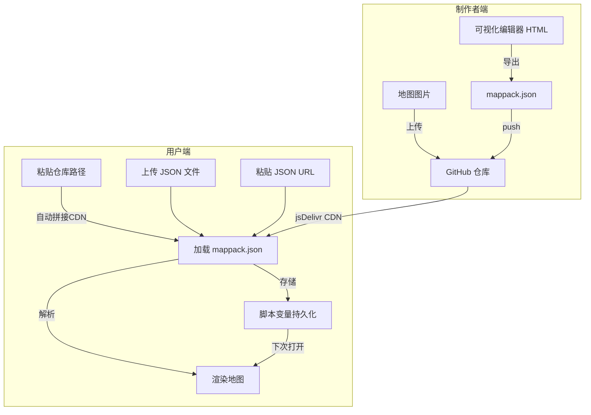

# 通用互动地图脚本 —— 架构设计

## 核心问题分析

General_Map 的痛点：
1. **图片和点位分离** → 用户先导入 JSON 点位，再手动逐个上传背景图
2. **无法便捷切换地图** → 只能导出当前 → 导入新的，一次只能用一套
3. **IndexedDB 存储图片** → 占用大量本地空间，且 base64 编码后数据膨胀

## 方案比较

### 方案 A: "地图包" JSON + CDN 图片 ⭐ 推荐

```
┌─────────────────────────────────────┐
│  Map Pack JSON (一个文件搞定)        │
│  {                                   │
│    name: "铁百合高中",                │
│    version: "1.0",                   │
│    baseUrl: "https://cdn.../maps/",  │  ← 图片基路径
│    maps: {                           │
│      root: {                         │
│        image: "overview.png",        │  ← 相对路径，拼接 baseUrl
│        pins: [                       │
│          { id, name, x, y, desc,     │
│            targetMapId?, color }     │
│        ]                             │
│      },                              │
│      sports: { ... },                │
│      culture: { ... }                │
│    }                                 │
│  }                                   │
└─────────────────────────────────────┘
```

**工作流:**
1. 地图制作者：上传图片到 GitHub 仓库 → 用可视化编辑器标点位 → 导出 Map Pack JSON
2. 用户：在脚本面板点"导入地图包" → 粘贴 JSON URL 或上传 JSON 文件 → 一键加载
3. 持久化：Map Pack JSON 存到脚本变量 (`replaceVariables`)
4. 切换地图：脚本内维护一个"已安装地图包"列表，随时切换

| 优点 | 缺点 |
|------|------|
| 一个文件导入全部数据 | 图片必须提前托管到 CDN |
| JSON 体积小（只有点位坐标和 URL） | 离线无法使用（依赖网络加载图片） |
| 支持多地图包并存和切换 | — |
| 分享简单（给一个 JSON 链接即可） | — |

> [!TIP]
> 图片都用 `baseUrl + 相对路径`，换 CDN 只需改 baseUrl 一处。

---

### 方案 B: 全嵌入式 (图片 base64 编码进 JSON)

把图片也打包进 JSON（base64 编码）。

| 优点 | 缺点 |
|------|------|
| 完全离线可用 | JSON 文件巨大（6张2MB图 ≈ 16MB JSON） |
| 零外部依赖 | 导入/导出慢 |
| — | 存入脚本变量可能超出酒馆限制 |
| — | 分享不便 |

**结论：❌ 不推荐**

---

### 方案 C: GitHub 仓库直接作为地图包源

不需要单独的 JSON 文件——脚本直接读取 GitHub 仓库的目录结构。

比如约定仓库结构：
```
kayanorin/SillyTavernimg/美高模拟器/地图/
├── mappack.json          ← 点位和层级配置
├── 学院俯瞰图.png
├── 体育区.png
└── ...
```

用户只需输入仓库路径 `kayanorin/SillyTavernimg/美高模拟器/地图`，脚本自动拼接 jsDelivr CDN URL 加载 `mappack.json`，再从同目录加载图片。

| 优点 | 缺点 |
|------|------|
| 用户操作最简单（给一个仓库路径） | 依赖 GitHub + jsDelivr |
| 图片和配置天然在一起 | 需要约定仓库目录格式 |
| 更新地图只需 push 到 GitHub | — |

> [!NOTE]
> 方案 C 本质上是方案 A 的特化版。可以**同时支持 A 和 C**：优先试从 URL 加载 `mappack.json`，也支持手动上传 JSON。

---

## 推荐架构：方案 A + C 混合

### 数据流



### mappack.json 格式规范

```jsonc
{
  // 地图包元信息
  "name": "铁百合高中校园地图",
  "version": "1.0.0",
  "author": "番茄",

  // 图片基础 URL（所有图片路径相对于此）
  "baseUrl": "https://testingcf.jsdelivr.net/gh/kayanorin/SillyTavernimg/美高模拟器/地图/",

  // 初始显示的地图 ID
  "defaultMapId": "overview",

  // 所有地图层级
  "maps": {
    "overview": {
      "name": "学院俯瞰图",
      "image": "学院俯瞰图.png",           // 相对于 baseUrl
      "pins": [
        {
          "id": "central",
          "name": "中央剑径",
          "x": 50, "y": 45,                // 百分比坐标
          "desc": "权力与行政中心",
          "color": "#e74c3c",
          "type": "portal",                 // portal = 跳转到子地图
          "targetMapId": "central_stem"
        },
        {
          "id": "sports",
          "name": "左翼·铁盾区",
          "x": 20, "y": 50,
          "desc": "体育与体能训练区",
          "color": "#3498db",
          "type": "portal",
          "targetMapId": "iron_shield"
        }
        // ...
      ]
    },
    "central_stem": {
      "name": "中央剑径",
      "image": "铁百合广场.png",
      "parentMapId": "overview",            // 父地图，用于返回
      "pins": [
        {
          "id": "plaza",
          "name": "铁百合广场",
          "x": 50, "y": 60,
          "desc": "校园中心广场",
          "color": "#e67e22",
          "type": "location"                // location = 普通地点，可前往
        },
        {
          "id": "admin_tower",
          "name": "中央行政塔楼",
          "x": 50, "y": 30,
          "desc": "校园最高建筑",
          "color": "#9b59b6",
          "type": "building",               // building = 有内部楼层
          "floors": [
            { "name": "B1 - 服务器机房与储物间", "desc": "..." },
            { "name": "1F - 大厅中庭", "desc": "铁百合剑雕塑" },
            { "name": "2F - 教职工办公区", "desc": "..." },
            { "name": "3F - 学生会总部", "desc": "议事厅 / 主席套房" },
            { "name": "4F - 战略STEM实验室", "desc": "..." },
            { "name": "5F - 观察塔尖", "desc": "观景台 / 心理韧性迷宫" }
          ]
        }
        // ...
      ]
    },
    "iron_shield": {
      "name": "左翼·铁盾区",
      "image": "体育区.png",
      "parentMapId": "overview",
      "pins": [ /* ... */ ]
    }
    // ... 其他区域
  }
}
```

### 持久化策略

```
脚本变量 (replaceVariables / getVariables)
├── installed_packs: [{              ← 已安装地图包列表
│     name, version, source_url,
│     data: { ... mappack内容 }
│   }]
├── active_pack_index: 0             ← 当前使用的地图包索引
├── current_map_id: "overview"       ← 当前查看的地图层级
└── theme: "dark" | "light"          ← 主题设置
```

> [!NOTE]
> 图片不存储到本地，始终从 CDN 加载。脚本变量只存 JSON 配置（几 KB）。

### 用户自定义问题

> [!IMPORTANT]
> **建议：不提供用户自定义点位功能**
>
> 理由：
> 1. 地图点位与背景图强相关，用户随意加点位很可能坐标对不上
> 2. 制作者通过可视化编辑器精确定位点位，质量更高
> 3. 保持脚本简洁，核心功能是"查看+导航"而非"编辑"
>
> 但**保留通用出行功能**：
> - 点击地点 → 弹出详情 → 点"前往" → 生成 `<request:>` 指令
> - 提供一个"自定义目的地"输入框（类似 General_Map 的"其他地点"功能）
> - 不需要"选同行人""选活动"这类复杂流程——直接前往，让 AI 自由发挥

---

## 可视化编辑器（Phase 2）

> [!NOTE]
> 这是一个**独立的HTML工具页面**，不是脚本的一部分。放在 `其它/MapPackEditor/` 下。

**功能:**
1. 上传地图图片 → 在图上点击放置 pin → 填写名称/描述
    --review：这里能不能加载文件夹？
2. 管理多层级关系（创建子地图、设置 portal 跳转）
3. 设置 baseUrl（填入 GitHub 仓库的 CDN 路径）
4. 一键导出 `mappack.json`

**这是 Phase 2 的工作，先把脚本主体做好，编辑器后面再做。** 初期可以手写 JSON 或者我帮你生成。

---

## 修正后的项目结构

### 脚本文件

```
src/美高模拟器/脚本/互动地图/
├── index.ts              # 入口：按钮绑定、面板挂载、生命周期
├── types.ts              # MapPack、Pin、MapLayer 等类型定义
├── store.ts              # Pinia store：地图包管理、持久化
├── mapRenderer.ts        # 缩放/平移/点位渲染引擎
├── mapUI.ts              # jQuery UI 组件（面板、弹窗、面包屑）
├── travelSystem.ts       # 出行指令生成
├── style.scss            # 样式（含日/夜双主题）
└── defaultPack.ts        # [可选] 内置美高地图包数据，作为默认
```

### 美高 YAML 更新

```yaml
酒馆助手:
  脚本库:
    - 名称: 地图                    # 现有的文本式地图（保留）
      ...
    - 名称: 互动地图                 # 新增的互动地图
      id: xxx
      启用: false                   # 默认关闭，用户自行选择开启
      类型: 脚本
      文件: 脚本\互动地图\index.js
```

## User Review Required

> [!IMPORTANT]
> **1. 方案确认**：你倾向于 **A+C 混合**（JSON 地图包 + GitHub 仓库路径快捷导入）还是有其他想法？
      --review：A+C混合
> [!IMPORTANT]
> **2. 用户自定义**：同意"不提供自定义点位，只保留通用出行入口"的思路吗？还是你觉得应该允许用户在已有地图包上叠加自己的点位？
      --review：这个直接复用general map（其它\General_Map）的出行逻辑（输入目的地、遇见 NPC）吧，那里的各种操作应该能覆盖用户需求了
> [!IMPORTANT]
> **3. 默认内置**：要不要在脚本里内置美高地图作为默认地图包（`defaultPack.ts`），这样美高卡用户装好就能用，不需要额外导入？其他卡的用户则需要自己导入地图包。
      --review：内置美高地图作为默认地图包
> [!IMPORTANT]
> **4. 可视化编辑器优先级**：先做脚本主体 + 手写美高 mappack.json，编辑器放 Phase 2？还是你觉得编辑器也需要同步做？
      --review：先做脚本主题，然后做编辑器，美高的mappack用编辑器做一下试试，这样正好检验能不能正常使用
## Verification Plan

### Phase 1 (本次)
- 脚本主体：面板 UI、缩放平移、层级跳转、点位交互、出行指令
- 手写美高 mappack.json
- `pnpm build` 编译通过
- 在酒馆中实机测试

### Phase 2 (后续)
- 可视化 MapPack 编辑器
- 多地图包管理 UI
